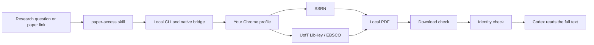

# Paper Access

**Give Codex the paper, not just the abstract.**

Paper Access is a local-first Agent Skill and browser bridge that lets Codex download, validate, and read full-text papers through access you already have. It currently supports SSRN and University of Toronto access to INFORMS papers through LibKey/EBSCO.

[中文说明](README.zh-CN.md) · [Install](INSTALL.md) · [Privacy](PRIVACY.md) · [Contributing](CONTRIBUTING.md)

> Preview: macOS + Google Chrome. INFORMS automation is currently configured for University of Toronto. SSRN supports one paper per request.

## Quick start

You need macOS, Google Chrome, and a local Codex environment that can run commands. Then paste this into Codex:

> Install Paper Access from https://github.com/LIMYOYO/paper-access-router. Read INSTALL.md and skills/paper-access/references/installation.md first. Set up the CLI, skill, Chrome extension, and native bridge, then verify the installation by downloading one real paper. Ask me only when Chrome permission, institutional login, MFA, or a website verification step needs my action.

Codex handles the local setup. You will normally need to:

1. Load the unpacked Chrome extension when Codex gives you its folder.
2. Approve the requested website permissions.
3. Sign in to University of Toronto/LibKey/EBSCO for INFORMS, or complete SSRN verification if prompted.
4. Keep that Chrome profile open while Paper Access runs.

The complete human-readable steps are in [INSTALL.md](INSTALL.md). Installing only `SKILL.md` is not enough because downloads also require the CLI, extension, and local native bridge included in this repository.

## Use it naturally

You do not need to name the skill after installation. Ask Codex the research question:

```text
Find recent M&SOM, Management Science, and SSRN papers on mobile AED deployment.
When an abstract is not enough to judge relevance, download the paper and read the relevant sections.
```

You can also give it a DOI or SSRN URL:

```text
Download and read https://pubsonline.informs.org/doi/10.1287/mnsc.2018.3061.
Tell me how its model differs from mine, with page-level evidence.
```

## What it does

- Downloads SSRN papers through the user's normal Chrome session.
- Routes INFORMS papers through University of Toronto LibKey/EBSCO access.
- Handles up to 10 INFORMS requests in one batch and isolates individual failures.
- Separates **download success** from **paper identity validation**. The default advisory mode can read a usable PDF whose identity still needs review; strict mode requires both gates.
- Reuses existing files and supports open copies when the requested version allows them.



## Access and privacy

Paper Access uses your existing lawful access. It does not provide subscriptions or bypass login, MFA, CAPTCHA, website verification, or download limits. Those steps stay in your browser and may require your action.

The project has no hosted backend, analytics, advertising, or account system. It does not read or export passwords, cookies, MFA responses, or institutional credentials. PDFs and task data stay on your computer. See [PRIVACY.md](PRIVACY.md).

## Current compatibility

| Component | Supported now |
| --- | --- |
| Operating system | macOS |
| Browser | Google Chrome |
| Agent | Codex with local command access |
| INFORMS | University of Toronto via LibKey/EBSCO |
| SSRN | Single-paper requests |
| Batch mode | Up to 10 INFORMS papers per batch |

Support for a route does not guarantee that a particular paper is covered by a subscription or that a website will not ask for verification. Other institutions and Windows/Linux have not yet been validated.

## Verification

The current preview has been tested on one macOS + Chrome installation with single-paper INFORMS and SSRN downloads, a 10-paper INFORMS batch, and mixed success/failure isolation. Every new installation still performs its own real-paper acceptance test.

Developer checks:

```sh
uv sync --dev
uv run pytest
npm test
npm run check
uv build
```

Real-browser acceptance requires the user's own authorized access. The repository contains no publisher PDFs, credentials, cookies, or session data.

## Repository layout

| Path | Purpose |
| --- | --- |
| `python/paper_access/` | CLI, task store, source adapters, validation, and native bridge |
| `src/`, `manifest.json` | Chrome extension loaded with **Load unpacked** |
| `skills/paper-access/` | Agent Skill and Codex installation references |
| `profiles/providers/` | Declared provider capabilities and limits |
| `tests/` | Python and extension tests |
| `docs/` | Design notes, access research, and acceptance evidence |

Paper Access is released under the [MIT License](LICENSE).
