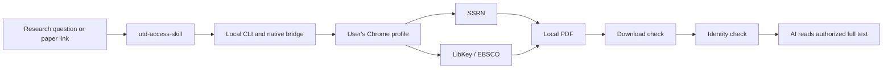

# UTD Access Skill

**Give your AI research assistant the full paper, not just the abstract.**

UTD Access Skill is a local-first Agent Skill and Chrome bridge for reading papers in the **UTD Top 24 business-journal set** and related SSRN working papers through access the user already has.

[中文说明](README.zh-CN.md) · [Install](INSTALL.md) · [Privacy](PRIVACY.md) · [Contributing](CONTRIBUTING.md)

> **UTD means the University of Texas at Dallas Top 24 journal set. It does not mean the University of Toronto.** University of Toronto is the institution used by the currently validated INFORMS LibKey/EBSCO route. The official and current journal list is maintained by [UT Dallas](https://jsom.utdallas.edu/the-utd-top-100-business-school-research-rankings/index.php).

## Quick start

Current requirements: macOS, Google Chrome, and a local Codex environment that can run commands. Paste this into Codex:

> Install UTD Access Skill from https://github.com/LIMYOYO/utd-access-skill. Read INSTALL.md and skills/utd-access-skill/references/installation.md first. Set up the CLI, skill, Chrome extension, and native bridge, then verify each route I need by downloading one real paper. Ask me only when Chrome permission, institutional login, MFA, or website verification needs my action.

Codex handles the local setup. You normally need to load the unpacked extension, approve its website permissions, authenticate through your own institution when needed, and keep that Chrome profile open.

Installing only `SKILL.md` is insufficient: browser acquisition also uses the CLI, extension, and native bridge in this repository. The preferred command is `utd-access-skill`; the legacy `utd-paper-access` and `paper-access` commands, data directory, and native bridge identifiers remain available for existing installations.

## Use it naturally

You do not need to name the skill after installation:

```text
Find recent UTD Top 24 and SSRN papers about mobile AED deployment.
When an abstract is insufficient to judge relevance, download the paper and read the relevant sections.
```

You can also provide an INFORMS DOI or SSRN URL:

```text
Download and read https://pubsonline.informs.org/doi/10.1287/mnsc.2018.3061.
Compare its model with mine and give page-level evidence.
```

## UTD Top 24 coverage

The official UTD ranking tracks 24 journals. Current support falls into four clear groups:

| Paper scope | What works now | Main limit |
| --- | --- | --- |
| **7 INFORMS journals in UTD24** | Automated download: DOI → LibKey → University of Toronto/EBSCO → local PDF | Batches of 1–10; only the University of Toronto route is validated; results remain per paper |
| **Other 17 UTD24 journals** | Find an open copy, read an existing PDF, or import a file downloaded by the user | No dedicated publisher automation yet |
| **SSRN working papers** | Automated single-paper download through Chrome, with separate download and identity results | No batch support yet; SSRN is not a UTD Top 24 journal |
| **Any lawfully obtained local PDF** | Import, validate, and make it available for AI reading | The user must already be authorized to possess the file |

The seven INFORMS journals are **Information Systems Research, INFORMS Journal on Computing, Marketing Science, Management Science, Operations Research, Manufacturing & Service Operations Management, and Organization Science**.

[See the complete 24-journal grouping and current boundaries](skills/utd-access-skill/references/utd24-coverage.md).

## Support status and roadmap

| Capability | Status now | Planned direction |
| --- | --- | --- |
| UTD24 INFORMS journals | Supported through the validated University of Toronto LibKey/EBSCO route | Improve resilience as publisher and EBSCO pages change. |
| Other institutions | Link planning accepts institution name, LibKey library ID, OpenAthens domain, and OpenURL resolver | Add institution profiles and configurable EBSCO tenants. Users currently need to adapt the route to their own library subscription and test one real paper. |
| SSRN | Single-paper acquisition | Add bounded batch requests after the single-paper route is stable across more samples. |
| Other 17 UTD24 journals | Open copy, local import, or manual authorized download only | Add publisher routes in small validated groups rather than claiming blanket coverage. |
| Platforms and browsers | macOS + Google Chrome | Validate Windows/Linux and additional Chromium browsers; Firefox is not supported. |
| Supplementary files, datasets, and code | Not a dedicated acquisition target | Add explicit artifact types and validation before automating them. |

## Research-use boundary

UTD Access Skill is designed to improve an AI research assistant's ability to read papers that the user is already authorized to access for personal research. It is not a paper-distribution service.

Do not use it to bypass subscriptions, login, MFA, CAPTCHA, website verification, rate limits, or license terms; mass-download a collection beyond the user's authorization; or redistribute, republish, or publicly share acquired PDFs. Institutional access and permission to read a paper do not automatically grant redistribution, text-and-data-mining, or AI-processing rights. The user remains responsible for the applicable library and publisher terms.

The project has no hosted backend, analytics, advertising, or account system. It does not export passwords, cookies, MFA responses, or institutional credentials. PDFs and task data stay on the user's computer. See [PRIVACY.md](PRIVACY.md).

## How it works



Download success and paper identity are separate gates. Advisory mode can read a complete PDF whose identity still needs review; strict mode requires both gates before analysis.

## Verification

The current preview has been tested on one macOS + Chrome installation with single-paper INFORMS and SSRN downloads, a 10-paper INFORMS batch, and mixed success/failure isolation. Every new institution and machine still needs its own real-paper acceptance test.

```sh
uv sync --dev
uv run pytest
npm test
npm run check
uv build
```

Real-browser acceptance requires the user's own authorized access. The repository contains no publisher PDFs, credentials, cookies, or session data.

## Repository layout

| Path | Purpose |
| --- | --- |
| `python/paper_access/` | CLI, task store, source adapters, validation, and native bridge |
| `src/`, `manifest.json` | Chrome extension loaded with **Load unpacked** |
| `skills/utd-access-skill/` | Agent Skill and Codex installation references |
| `profiles/providers/` | Declared provider capabilities and limits |
| `tests/` | Python and extension tests |
| `docs/` | Design notes, access research, and acceptance evidence |

UTD Access Skill is released under the [MIT License](LICENSE).
